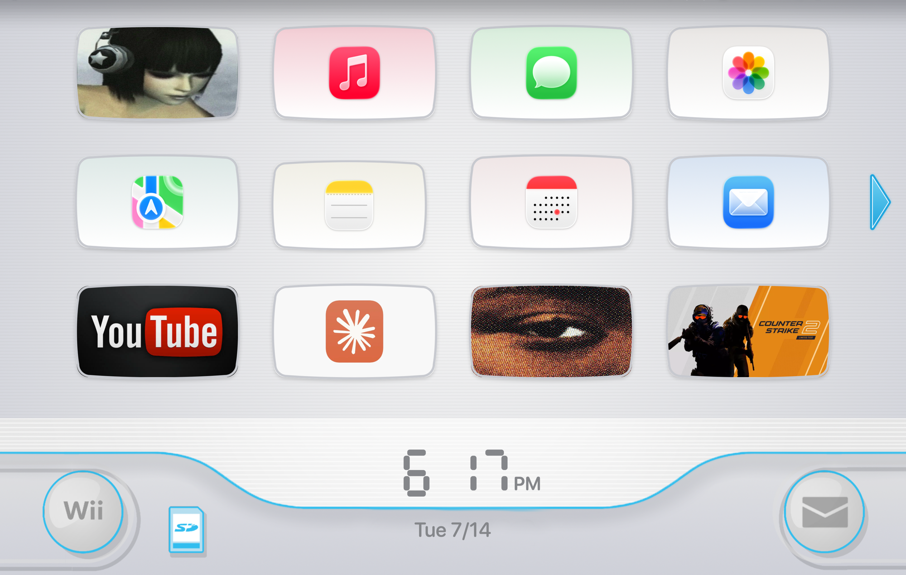
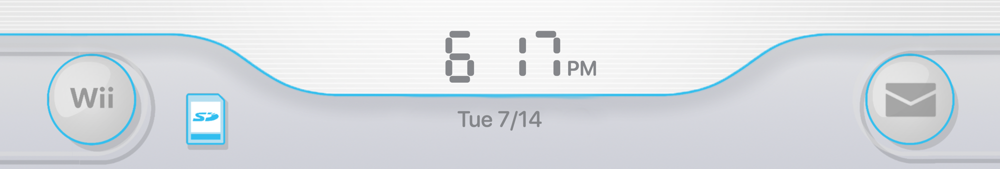

# Ivan's Menu

Turn your Mac desktop into a faithful, interactive Wii-style channel menu. Every channel launches a real app, website, file, or folder, and the whole thing lives behind your windows like a wallpaper.



## Features

- **Real launcher, not a picture.** Click a channel to open an app, a URL, a file, or a folder.
- **Lives on the desktop.** It draws behind your windows at the desktop layer and hides the Finder desktop icons for full immersion.
- **Menu-bar agent.** Runs quietly with no Dock icon. Everything is reachable from a single menu-bar item.
- **The details you remember.** Pillow-shaped channel tiles, the segmented clock, the bottom bar with the Wii and mail buttons, and the soft channel-change motion.
- **Right-click to configure.** Point any tile at an app, a website, or a custom image or GIF thumbnail, then rename it, all in place.
- **Peek the real desktop** any time with a keyboard shortcut, without quitting.

## Screenshots

| Full menu | Bottom bar |
| --- | --- |
|  |  |

## Install

### Download (recommended)

1. Grab the latest `IvansMenu.dmg` from the [Releases page](https://github.com/IvanKuria/ivans-menu/releases).
2. Open the DMG and drag **Ivan's Menu** into your Applications folder.
3. Launch it. The first run walks you through picking your channels.

The build is signed and notarized by Apple, so it opens without a Gatekeeper warning.

### Build from source

You need the Xcode Command Line Tools (`xcode-select --install`). Xcode itself is not required.

```bash
git clone https://github.com/IvanKuria/ivans-menu.git
cd ivans-menu
./scripts/bundle.sh      # assembles IvansMenu.app
open IvansMenu.app
```

The repository ships original, hand-drawn fallback art, so a fresh clone runs on its own. A higher-fidelity theme pack can be installed later from Settings, or headlessly:

```bash
.build/debug/IvansMenu --install-theme
```

That downloads the pack into `~/Library/Application Support/Ivan's Menu/Wii/`. Point it at a different manifest by passing a URL after the flag.

## Usage

- The first launch runs an onboarding wizard to set up your channels.
- The round **Wii** button in the bottom-left corner, or the menu-bar item, opens Settings.
- **Right-click any tile** to set its app, website, or thumbnail, rename it, or clear it.
- Hold **Option and press Space** to peek at your real desktop, then release to return.
- Quit from the menu-bar item. Quitting restores your Finder desktop icons.

## Troubleshooting

If the app quits unexpectedly and your desktop icons are missing, restore them either way:

- Click the menu-bar item, then **Restore Desktop Icons**, or
- Run this in Terminal:

  ```bash
  defaults write com.apple.finder CreateDesktop true && killall Finder
  ```

## Development

```bash
swift build            # debug build
swift test             # run the IvansMenuKit test suite
./scripts/bundle.sh    # assemble IvansMenu.app (set DEVELOPER_ID to code-sign)
```

The project is split into two targets:

- **IvansMenuKit** holds the pure logic (config model, banner planning, clock formatting) with no AppKit dependency, so it is fully unit-tested.
- **IvansMenu** is the AppKit and SwiftUI executable that draws the desktop window and wires up the launcher.

To preview the UI without touching your desktop, render it to a PNG:

```bash
swift build && .build/debug/IvansMenu --render out.png 1710 1112
```

### Releasing

`scripts/release.sh` builds, signs, packages, notarizes, and staples a distributable DMG. See the comments at the top of that script for the one-time credential setup.

## Disclaimer

Ivan's Menu is an unofficial, fan-made tribute. It is not affiliated with, endorsed by, or sponsored by Nintendo. All Nintendo trademarks belong to their respective owners. The public repository ships no Nintendo assets. The bundled fallback art is original and the bundled fonts are licensed under the SIL Open Font License.

## Credits

- Fonts: Asap and M PLUS Rounded 1c, both under the SIL Open Font License.
- Inspired by the 2006 Wii Menu.

## License

Code is released under the MIT License. See [LICENSE](LICENSE). The license covers the source code only, not any third-party art, sound, or trademarks.
